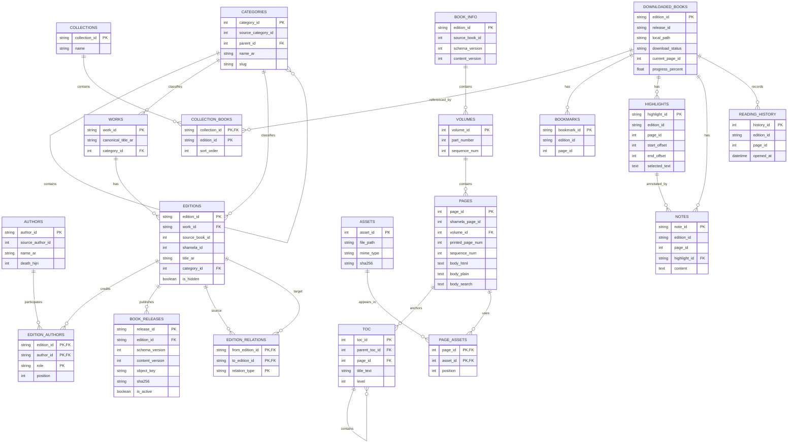
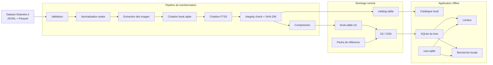

# Data Model — Application de lecture Shamela offline

## 1. Objectif

Ce document décrit le modèle de données recommandé pour transformer le dataset **Shamela 4 — Full Islamic Library Corpus** en une architecture exploitable par une application de lecture principalement offline.

L'objectif est de permettre :

- la consultation d'un catalogue complet sans télécharger tous les livres ;
- le téléchargement indépendant de chaque livre ;
- la lecture offline ;
- la recherche plein texte en arabe dans chaque livre ;
- la gestion locale des collections, favoris, marque-pages, notes et progression ;
- la mise à jour des livres sans casser les données utilisateur ;
- l'ajout futur de plusieurs éditions d'une même œuvre ;
- l'utilisation optionnelle de données avancées : versets, narrateurs, isnads, racines arabes et références croisées.

L'authentification, les comptes distants et la synchronisation cloud ne font pas partie de ce modèle.

---

## 2. Données source

Le dataset source contient environ :

- **8 589 livres** ;
- **7,6 millions de pages** ;
- **4 millions d'entrées de table des matières** ;
- **3 187 auteurs** ;
- **41 catégories** ;
- **19 Go de texte arabe**.

Chaque livre contient principalement :

- `manifest.json` : intégrité, checksums et compteurs ;
- `book_metadata.json` : métadonnées bibliographiques ;
- `toc.jsonl` : table des matières hiérarchique ;
- `pages.jsonl` : contenu des pages.

Les pages source contiennent notamment :

- `page_id` ;
- `book_id` ;
- `shamela_page_id` ;
- `part` ;
- `page_num` ;
- `sequence_num` ;
- `body` ;
- `footnotes` ;
- `hints` ;
- `services_raw`.

Le contenu peut inclure du HTML minimal, des marqueurs de notes, des retours `\r` et parfois des images encodées en Base64.

---

## 3. Architecture générale

Le modèle est divisé en quatre ensembles indépendants.

| Ensemble | Rôle | Format recommandé |
|---|---|---|
| Catalogue central | Métadonnées de tous les livres disponibles | `catalog.sqlite` |
| Livre téléchargé | Texte, sommaire, index et ressources d'un livre | `book.sqlite` par édition |
| Données utilisateur | Collections, notes, progression et favoris | `user.sqlite` |
| Packs de référence | Coran, narrateurs, racines et références croisées | SQLite optionnels |

```text
catalog.sqlite
user.sqlite
books/
  {edition_id}/
    book.sqlite
    manifest.json
    cover.webp
    assets/
reference-packs/
  quran.sqlite
  narrators.sqlite
  hadith-xrefs.sqlite
  roots.sqlite
```

### Pourquoi plusieurs bases SQLite ?

Une base unique contenant 19 Go de texte serait difficile à distribuer, mettre à jour et sauvegarder.

Une base par livre permet :

- un téléchargement progressif ;
- une suppression indépendante ;
- une vérification d'intégrité par fichier ;
- une mise à jour ciblée ;
- une recherche locale rapide ;
- une meilleure isolation des erreurs ;
- un stockage compatible mobile et desktop.

---

## 4. Concepts principaux

### 4.1 Work

Une `work` représente l'œuvre intellectuelle abstraite.

Exemple :

```text
صحيح البخاري
```

Une œuvre peut avoir plusieurs éditions, plusieurs versions ou plusieurs fichiers sources.

### 4.2 Edition

Une `edition` représente une version bibliographique précise d'une œuvre.

Elle peut différer par :

- l'éditeur ;
- le muhaqqiq ;
- le découpage en volumes ;
- la pagination ;
- le texte ;
- les notes ;
- la qualité de numérisation.

Dans le MVP, chaque `book_id` Shamela peut être importé comme une édition indépendante.

### 4.3 Release

Une `release` représente un fichier distribué à l'application.

```text
work
  └── edition
        └── release
              └── book.sqlite.zst
```

Une nouvelle release est créée lorsqu'un livre est régénéré, corrigé ou migré vers une nouvelle version de schéma.

---

## 5. Identifiants

### 5.1 Identifiants source

Les identifiants Shamela doivent être conservés :

- `book_id` ;
- `shamela_id` ;
- `shamela_page_id` ;
- `shamela_title_id` ;
- `source_author_id` ;
- `source_category_id`.

Ils servent à :

- garantir la traçabilité ;
- rejouer les imports ;
- diagnostiquer les écarts ;
- maintenir les références vers le dataset source.

### 5.2 Identifiants internes

Les entités distribuées doivent utiliser des identifiants stables indépendants de la source.

Format recommandé : UUID ou ULID stocké en `TEXT`.

Exemples :

```text
work_id
edition_id
author_id
release_id
collection_id
highlight_id
```

### 5.3 Identifiants stables et déterministes

Pour éviter de recréer des identifiants différents à chaque import, les IDs peuvent être générés de manière déterministe.

Exemple :

```text
edition_id = UUIDv5(namespace_shamela, "edition:book_id:123")
author_id  = UUIDv5(namespace_shamela, "author:source_author_id:513")
```

---

# Partie A — Catalogue central

## 6. Rôle du catalogue

Le catalogue contient uniquement les informations nécessaires pour :

- afficher les livres ;
- filtrer par catégorie ;
- rechercher un titre ou un auteur ;
- afficher la taille du téléchargement ;
- vérifier les mises à jour ;
- récupérer l'URL du fichier ;
- vérifier le hash du fichier ;
- afficher les relations entre œuvres.

Il ne contient pas le texte complet des livres.

---

## 7. Table `categories`

```sql
CREATE TABLE categories (
    category_id         INTEGER PRIMARY KEY,
    source_category_id  INTEGER,
    parent_id           INTEGER,
    name_ar             TEXT NOT NULL,
    name_normalized     TEXT NOT NULL,
    slug                TEXT NOT NULL UNIQUE,
    sort_order          INTEGER NOT NULL DEFAULT 0,
    FOREIGN KEY (parent_id) REFERENCES categories(category_id)
);
```

| Colonne | Description |
|---|---|
| `category_id` | Identifiant interne |
| `source_category_id` | Identifiant Shamela |
| `parent_id` | Catégorie parente éventuelle |
| `name_ar` | Nom original en arabe |
| `name_normalized` | Nom normalisé pour la recherche |
| `slug` | Identifiant lisible et stable |
| `sort_order` | Ordre d'affichage |

---

## 8. Table `authors`

```sql
CREATE TABLE authors (
    author_id           TEXT PRIMARY KEY,
    source_author_id    INTEGER,
    name_ar             TEXT NOT NULL,
    name_normalized     TEXT NOT NULL,
    death_hijri         INTEGER,
    death_ce            INTEGER,
    biography           TEXT
);
```

### Remarque sur les dates

Les dates de décès doivent être conservées comme fournies par la source.

Il est préférable de stocker séparément :

- l'année hégirienne ;
- l'année grégorienne si connue ;
- éventuellement une valeur brute source dans une version future.

---

## 9. Table `works`

```sql
CREATE TABLE works (
    work_id                 TEXT PRIMARY KEY,
    canonical_title_ar      TEXT NOT NULL,
    title_normalized        TEXT NOT NULL,
    category_id             INTEGER,
    description             TEXT,
    cover_url               TEXT,
    FOREIGN KEY (category_id) REFERENCES categories(category_id)
);
```

Une œuvre contient les informations communes à plusieurs éditions.

Dans le MVP, une œuvre peut être créée automatiquement pour chaque édition. Le regroupement de plusieurs éditions sous une même œuvre pourra être amélioré ultérieurement.

---

## 10. Table `editions`

```sql
CREATE TABLE editions (
    edition_id              TEXT PRIMARY KEY,
    work_id                 TEXT NOT NULL,
    source                  TEXT NOT NULL DEFAULT 'shamela4',
    source_book_id          INTEGER NOT NULL,
    shamela_id              INTEGER,
    title_ar                TEXT NOT NULL,
    title_normalized        TEXT NOT NULL,
    category_id             INTEGER,
    book_type               INTEGER,
    book_type_label         TEXT,
    bibliography_text       TEXT,
    printed                 INTEGER NOT NULL DEFAULT 0,
    is_hidden               INTEGER NOT NULL DEFAULT 0,
    volume_count            INTEGER NOT NULL DEFAULT 0,
    has_multi_part          INTEGER NOT NULL DEFAULT 0,
    language                TEXT NOT NULL DEFAULT 'ar',
    cover_url               TEXT,
    FOREIGN KEY (work_id) REFERENCES works(work_id),
    FOREIGN KEY (category_id) REFERENCES categories(category_id)
);

CREATE UNIQUE INDEX idx_editions_source_book
ON editions(source, source_book_id);
```

### Règle de distribution

Les éditions avec `is_hidden = 1` ne doivent pas être publiées automatiquement. Elles doivent passer par une règle de validation séparée.

---

## 11. Table `edition_authors`

Une édition peut avoir plusieurs personnes associées avec des rôles différents.

```sql
CREATE TABLE edition_authors (
    edition_id  TEXT NOT NULL,
    author_id   TEXT NOT NULL,
    role        TEXT NOT NULL,
    position    INTEGER NOT NULL DEFAULT 0,
    PRIMARY KEY (edition_id, author_id, role),
    FOREIGN KEY (edition_id) REFERENCES editions(edition_id),
    FOREIGN KEY (author_id) REFERENCES authors(author_id)
);
```

Rôles possibles :

```text
author
editor
compiler
translator
commentator
investigator
reviewer
unknown
```

Le champ `position` permet de conserver l'ordre d'affichage.

---

## 12. Table `book_releases`

```sql
CREATE TABLE book_releases (
    release_id          TEXT PRIMARY KEY,
    edition_id          TEXT NOT NULL,
    schema_version      INTEGER NOT NULL,
    content_version     INTEGER NOT NULL,
    source_version      TEXT,
    object_key          TEXT NOT NULL,
    manifest_url        TEXT,
    compressed_size     INTEGER NOT NULL,
    uncompressed_size   INTEGER NOT NULL,
    sha256              TEXT NOT NULL,
    page_count          INTEGER NOT NULL,
    toc_count           INTEGER NOT NULL,
    fts_version         INTEGER NOT NULL DEFAULT 1,
    min_app_version     TEXT,
    published_at        TEXT NOT NULL,
    is_active           INTEGER NOT NULL DEFAULT 1,
    FOREIGN KEY (edition_id) REFERENCES editions(edition_id)
);

CREATE INDEX idx_book_releases_edition
ON book_releases(edition_id, is_active);
```

### Responsabilités

Cette table permet à l'application de connaître :

- le fichier à télécharger ;
- la taille affichée avant téléchargement ;
- la version installable ;
- le hash attendu ;
- la compatibilité avec l'application ;
- la release active.

### `object_key` : une clé, pas une URL

La colonne s'appelait `download_url` et contenait une URL absolue. Elle liait le
catalogue à l'hébergeur qui l'avait publié : servir les mêmes livres depuis un
autre bucket imposait de republier le catalogue entier.

Elle contient désormais une **clé relative** à une base configurée côté client :

```text
books/<edition_id>/<content_version>/book.sqlite.zst
```

L'application colle cette clé derrière son réglage `distribution.base_url`. Une
seule règle décide, et elle est explicite : **la présence de `://` marque un
absolu**.

| Valeur | Effet |
| --- | --- |
| `books/sh-8/1/book.sqlite.zst` | téléchargée depuis la base configurée |
| `https://autre-hote/x.zst` | téléchargée telle quelle, base ignorée |
| `asset://books/x.sqlite` | copiée depuis les assets embarqués |
| `local://books/x.sqlite` | copiée depuis la bibliothèque source locale |

Les deux dernières formes gardent `assets/sample` et `dist/shamela` utilisables
hors ligne, et permettent aux tests de tourner sans réseau. La deuxième rend la
migration douce : un catalogue publié à l'ancienne continue de fonctionner.

Ce changement porte `schema_version` du catalogue à **2**. Un client de schéma 1
ne sait pas lire un catalogue de schéma 2 — c'est pourquoi le pointeur de
distribution (`catalog/latest.json`) l'annonce, et qu'une application trop
ancienne refuse d'installer avant de télécharger.

### Convention de versioning

```text
schema_version
```

Version de la structure SQLite.

```text
content_version
```

Version du contenu bibliographique ou textuel.

```text
fts_version
```

Version de la logique de normalisation et d'indexation.

---

## 13. Table `edition_relations`

```sql
CREATE TABLE edition_relations (
    from_edition_id  TEXT NOT NULL,
    to_edition_id    TEXT NOT NULL,
    relation_type    TEXT NOT NULL,
    PRIMARY KEY (from_edition_id, to_edition_id, relation_type),
    FOREIGN KEY (from_edition_id) REFERENCES editions(edition_id),
    FOREIGN KEY (to_edition_id) REFERENCES editions(edition_id)
);
```

Relations possibles :

| Relation | Description |
|---|---|
| `same_work` | Deux éditions de la même œuvre |
| `commentary_of` | Commentaire d'un autre livre |
| `summary_of` | Résumé |
| `translation_of` | Traduction |
| `continuation_of` | Continuation |
| `volume_of` | Volume rattaché à un ensemble |
| `related_to` | Relation générique |

---

## 14. Recherche dans le catalogue

```sql
CREATE VIRTUAL TABLE catalog_fts USING fts5(
    edition_id UNINDEXED,
    title_ar,
    title_normalized,
    author_names,
    bibliography_text,
    tokenize = 'unicode61'
);
```

L'index catalogue doit permettre une recherche rapide sans ouvrir les bases des livres.

Le champ `author_names` peut être dénormalisé dans l'index uniquement pour la recherche.

---

# Partie B — SQLite par livre

## 15. Rôle du fichier livre

Chaque fichier `book.sqlite` contient tout ce qui est nécessaire pour lire et rechercher une édition offline.

Le fichier doit être autonome et en lecture seule après installation.

Structure de package recommandée :

```text
book-package.zip
├── book.sqlite
├── manifest.json
├── cover.webp
└── assets/
    ├── image-0001.webp
    └── image-0002.webp
```

Une autre option consiste à inclure les petits assets dans SQLite sous forme de BLOB. Pour les livres contenant beaucoup d'images, des fichiers séparés sont préférables.

---

## 16. Table `book_info`

Une seule ligne doit exister dans cette table.

```sql
CREATE TABLE book_info (
    edition_id          TEXT PRIMARY KEY,
    source_book_id      INTEGER NOT NULL,
    shamela_id          INTEGER,
    title_ar            TEXT NOT NULL,
    schema_version      INTEGER NOT NULL,
    content_version     INTEGER NOT NULL,
    page_count          INTEGER NOT NULL,
    toc_count           INTEGER NOT NULL,
    created_at          TEXT NOT NULL,
    content_hash        TEXT NOT NULL
);
```

Elle permet de vérifier qu'un fichier correspond bien à l'édition attendue.

---

## 17. Table `volumes`

```sql
CREATE TABLE volumes (
    volume_id       INTEGER PRIMARY KEY,
    part_number     INTEGER,
    label_ar        TEXT,
    sequence_num    INTEGER NOT NULL,
    first_page_id   INTEGER,
    last_page_id    INTEGER
);
```

Tous les livres n'ont pas forcément de volumes explicites.

Pour un livre simple, deux approches sont possibles :

1. créer un volume unique ;
2. conserver `volume_id = NULL` dans les pages.

Créer un volume unique simplifie généralement le code du lecteur.

---

## 18. Table `pages`

```sql
CREATE TABLE pages (
    page_id             INTEGER PRIMARY KEY,
    shamela_page_id     INTEGER,
    volume_id           INTEGER,
    printed_page_num    INTEGER,
    sequence_num        INTEGER NOT NULL,
    body_html           TEXT NOT NULL,
    body_plain          TEXT NOT NULL,
    body_search         TEXT NOT NULL,
    footnotes           TEXT,
    footnotes_search    TEXT,
    hints               TEXT,
    content_hash        TEXT NOT NULL,
    FOREIGN KEY (volume_id) REFERENCES volumes(volume_id)
);

CREATE UNIQUE INDEX idx_pages_sequence
ON pages(sequence_num);

CREATE INDEX idx_pages_printed_page
ON pages(volume_id, printed_page_num);
```

### Signification des représentations du texte

| Colonne | Utilisation |
|---|---|
| `body_html` | Affichage fidèle |
| `body_plain` | Sélection, copie et citations |
| `body_search` | Recherche arabe normalisée |
| `footnotes` | Affichage des notes |
| `footnotes_search` | Recherche dans les notes |

### Pourquoi conserver plusieurs représentations ?

Le texte de rendu ne doit pas être modifié pour faciliter la recherche. La normalisation doit rester séparée du texte original.

---

## 19. Table `toc`

```sql
CREATE TABLE toc (
    toc_id              INTEGER PRIMARY KEY,
    parent_toc_id       INTEGER,
    page_id             INTEGER NOT NULL,
    title_text          TEXT NOT NULL,
    title_normalized    TEXT NOT NULL,
    level               INTEGER NOT NULL,
    sequence_num        INTEGER NOT NULL,
    shamela_title_id    INTEGER,
    FOREIGN KEY (parent_toc_id) REFERENCES toc(toc_id),
    FOREIGN KEY (page_id) REFERENCES pages(page_id)
);

CREATE INDEX idx_toc_page
ON toc(page_id);

CREATE INDEX idx_toc_parent
ON toc(parent_toc_id, sequence_num);
```

### Champ `level`

Le niveau peut être calculé pendant l'import à partir de `parent_id`.

Il accélère l'affichage du sommaire et permet de détecter les cycles ou hiérarchies invalides.

---

## 20. Index FTS5 des pages

### Option recommandée : FTS avec contenu externe

```sql
CREATE VIRTUAL TABLE pages_fts USING fts5(
    body_search,
    footnotes_search,
    content = 'pages',
    content_rowid = 'page_id',
    tokenize = 'unicode61'
);
```

Après insertion des pages :

```sql
INSERT INTO pages_fts(pages_fts) VALUES('rebuild');
```

### Recherche

```sql
SELECT
    p.page_id,
    p.volume_id,
    p.printed_page_num,
    snippet(pages_fts, 0, '<mark>', '</mark>', '…', 20) AS excerpt
FROM pages_fts
JOIN pages p ON p.page_id = pages_fts.rowid
WHERE pages_fts MATCH ?
ORDER BY bm25(pages_fts)
LIMIT 50;
```

### Recherche exacte

La recherche exacte peut être effectuée sur `body_plain` avec `instr`, mais elle sera moins rapide.

---

## 21. Normalisation arabe

La normalisation doit être appliquée uniquement aux colonnes de recherche.

Pipeline recommandé :

1. normaliser Unicode en NFC ou NFKC selon les tests ;
2. remplacer `\r` par `\n` ;
3. supprimer le tatweel `ـ` ;
4. supprimer les harakāt ;
5. normaliser `أ`, `إ`, `آ`, `ٱ` vers `ا` ;
6. normaliser éventuellement `ى` vers `ي` ;
7. normaliser éventuellement `ة` vers `ه` dans un index secondaire seulement ;
8. supprimer les espaces multiples ;
9. conserver les chiffres et ponctuations utiles ;
10. ne jamais écraser le texte original.

### Recommandation

Utiliser deux niveaux de normalisation :

| Mode | Description |
|---|---|
| Modéré | Supprime harakāt, tatweel et variantes d'alif |
| Large | Ajoute la normalisation de `ى`, `ة` et autres variantes |

Le mode modéré doit être la base par défaut afin de limiter les faux positifs.

---

## 22. Table `assets`

```sql
CREATE TABLE assets (
    asset_id     INTEGER PRIMARY KEY,
    file_path    TEXT NOT NULL UNIQUE,
    mime_type    TEXT NOT NULL,
    sha256       TEXT NOT NULL,
    width        INTEGER,
    height       INTEGER,
    byte_size    INTEGER NOT NULL
);
```

## 23. Table `page_assets`

```sql
CREATE TABLE page_assets (
    page_id      INTEGER NOT NULL,
    asset_id     INTEGER NOT NULL,
    position     INTEGER NOT NULL DEFAULT 0,
    PRIMARY KEY (page_id, asset_id),
    FOREIGN KEY (page_id) REFERENCES pages(page_id),
    FOREIGN KEY (asset_id) REFERENCES assets(asset_id)
);
```

### Transformation des images Base64

Entrée source :

```html

```

Sortie :

```html

```

Le pipeline doit :

- décoder l'image ;
- calculer son SHA-256 ;
- dédupliquer les images identiques ;
- convertir vers WebP si la qualité reste acceptable ;
- remplacer la source Base64 dans le HTML.

---

# Partie C — Base locale utilisateur

## 24. Principes

`user.sqlite` doit rester séparé des bases livres.

Cette séparation est essentielle car :

- un livre peut être supprimé sans supprimer les notes ;
- un livre peut être mis à jour sans écraser la progression ;
- la base utilisateur peut être sauvegardée indépendamment ;
- une synchronisation cloud pourra être ajoutée plus tard ;
- les fichiers livres peuvent rester en lecture seule.

---

## 25. Table `downloaded_books`

```sql
CREATE TABLE downloaded_books (
    edition_id          TEXT PRIMARY KEY,
    release_id          TEXT NOT NULL,
    local_path          TEXT NOT NULL,
    download_status     TEXT NOT NULL,
    downloaded_bytes    INTEGER NOT NULL DEFAULT 0,
    total_bytes         INTEGER NOT NULL DEFAULT 0,
    downloaded_at       TEXT,
    last_opened_at      TEXT,
    current_page_id     INTEGER,
    current_offset      INTEGER NOT NULL DEFAULT 0,
    progress_percent    REAL NOT NULL DEFAULT 0,
    last_error          TEXT
);
```

États recommandés :

```text
queued
downloading
verifying
installing
installed
failed
update_available
removing
```

---

## 26. Tables `collections` et `collection_books`

```sql
CREATE TABLE collections (
    collection_id   TEXT PRIMARY KEY,
    name            TEXT NOT NULL,
    description     TEXT,
    sort_order      INTEGER NOT NULL DEFAULT 0,
    created_at      TEXT NOT NULL,
    updated_at      TEXT NOT NULL
);

CREATE TABLE collection_books (
    collection_id   TEXT NOT NULL,
    edition_id      TEXT NOT NULL,
    sort_order      INTEGER NOT NULL DEFAULT 0,
    added_at        TEXT NOT NULL,
    PRIMARY KEY (collection_id, edition_id),
    FOREIGN KEY (collection_id) REFERENCES collections(collection_id)
);
```

Une édition peut appartenir à plusieurs collections.

Exemples :

```text
À lire
Fiqh malikite
Hadith
Études en cours
Favoris
```

---

## 27. Table `bookmarks`

```sql
CREATE TABLE bookmarks (
    bookmark_id     TEXT PRIMARY KEY,
    edition_id      TEXT NOT NULL,
    page_id         INTEGER NOT NULL,
    text_offset     INTEGER,
    label           TEXT,
    created_at      TEXT NOT NULL
);
```

`page_id` fait référence au fichier livre, mais aucune contrainte SQL n'est possible entre deux fichiers SQLite distincts.

La validation doit être faite par l'application.

---

## 28. Table `highlights`

```sql
CREATE TABLE highlights (
    highlight_id    TEXT PRIMARY KEY,
    edition_id      TEXT NOT NULL,
    page_id         INTEGER NOT NULL,
    start_offset    INTEGER NOT NULL,
    end_offset      INTEGER NOT NULL,
    selected_text   TEXT NOT NULL,
    prefix_text     TEXT,
    suffix_text     TEXT,
    color           TEXT,
    created_at      TEXT NOT NULL,
    updated_at      TEXT NOT NULL
);
```

### Pourquoi stocker le contexte textuel ?

Les offsets peuvent devenir invalides après une mise à jour du livre.

Ces champs permettent de retrouver le passage :

- `selected_text` ;
- `prefix_text` ;
- `suffix_text`.

Lors d'une migration, l'application peut rechercher le texte sélectionné et son contexte dans la nouvelle version de la page.

---

## 29. Table `notes`

```sql
CREATE TABLE notes (
    note_id         TEXT PRIMARY KEY,
    edition_id      TEXT NOT NULL,
    page_id         INTEGER,
    highlight_id    TEXT,
    content         TEXT NOT NULL,
    created_at      TEXT NOT NULL,
    updated_at      TEXT NOT NULL,
    FOREIGN KEY (highlight_id) REFERENCES highlights(highlight_id)
);
```

Une note peut être associée :

- à un livre ;
- à une page ;
- à un surlignage.

---

## 30. Table `reading_history`

```sql
CREATE TABLE reading_history (
    history_id          INTEGER PRIMARY KEY AUTOINCREMENT,
    edition_id          TEXT NOT NULL,
    page_id             INTEGER NOT NULL,
    opened_at           TEXT NOT NULL,
    duration_seconds    INTEGER NOT NULL DEFAULT 0
);

CREATE INDEX idx_reading_history_book
ON reading_history(edition_id, opened_at DESC);
```

Cette table peut devenir volumineuse. Une politique de compactage peut agréger les anciennes lignes par jour ou par session.

---

## 31. Table optionnelle `recent_searches`

```sql
CREATE TABLE recent_searches (
    search_id       INTEGER PRIMARY KEY AUTOINCREMENT,
    scope           TEXT NOT NULL,
    edition_id      TEXT,
    query_text      TEXT NOT NULL,
    searched_at     TEXT NOT NULL
);
```

Le champ `scope` peut valoir :

```text
catalog
book
library
```

---

# Partie D — Packs de référence

## 32. Pourquoi les séparer ?

Les données globales ne doivent pas être dupliquées dans tous les livres.

Exemples :

- Coran ;
- narrateurs ;
- isnads ;
- références hadith ;
- références tafsir ;
- dictionnaire de racines.

Une duplication par livre augmenterait fortement la taille totale et rendrait les mises à jour difficiles.

---

## 33. Packs proposés

| Fichier | Contenu | Installation |
|---|---|---|
| `quran.sqlite` | Sourates, versets et texte normalisé | Inclus ou téléchargement léger |
| `narrators.sqlite` | Narrateurs et biographies | Optionnel |
| `hadith-xrefs.sqlite` | Références croisées de hadith | Optionnel |
| `tafsir-xrefs.sqlite` | Liens entre pages et versets | Optionnel |
| `roots.sqlite` | Dictionnaire de racines arabes | Optionnel, volumineux |

---

## 34. Exemple `quran.sqlite`

```sql
CREATE TABLE quran_verses (
    verse_id            INTEGER PRIMARY KEY,
    surah_number        INTEGER NOT NULL,
    verse_number        INTEGER NOT NULL,
    text_ar             TEXT NOT NULL,
    text_normalized     TEXT NOT NULL,
    UNIQUE (surah_number, verse_number)
);
```

---

## 35. Exemple `narrators.sqlite`

```sql
CREATE TABLE narrators (
    narrator_id         INTEGER PRIMARY KEY,
    name_ar             TEXT NOT NULL,
    name_normalized     TEXT NOT NULL,
    death_hijri         INTEGER,
    biography           TEXT
);

CREATE TABLE page_isnads (
    isnad_id            INTEGER PRIMARY KEY,
    edition_id          TEXT NOT NULL,
    page_id             INTEGER NOT NULL,
    isnad_text          TEXT
);

CREATE TABLE isnad_narrators (
    isnad_id            INTEGER NOT NULL,
    narrator_id         INTEGER NOT NULL,
    sequence_num        INTEGER NOT NULL,
    PRIMARY KEY (isnad_id, narrator_id, sequence_num),
    FOREIGN KEY (isnad_id) REFERENCES page_isnads(isnad_id),
    FOREIGN KEY (narrator_id) REFERENCES narrators(narrator_id)
);
```

---

# Partie E — Distribution et stockage

## 36. Organisation S3/CDN

```text
catalog/
  v12/
    catalog.sqlite.zst
    catalog.manifest.json

books/
  {edition_id}/
    v1/
      book.sqlite.zst
      manifest.json
      cover.webp
    v2/
      book.sqlite.zst
      manifest.json
      cover.webp

packs/
  quran/
    v1/quran.sqlite.zst
  narrators/
    v1/narrators.sqlite.zst
```

### Règle importante

Les chemins de release doivent être immutables.

Mauvais exemple :

```text
books/{edition_id}/latest/book.sqlite
```

Bon exemple :

```text
books/{edition_id}/v3/book.sqlite.zst
```

Le catalogue indique ensuite quelle version est active.

---

## 37. Manifest d'un livre

```json
{
  "edition_id": "01J...",
  "release_id": "01K...",
  "schema_version": 1,
  "content_version": 3,
  "fts_version": 1,
  "source": "shamela4",
  "source_book_id": 123,
  "page_count": 842,
  "toc_count": 301,
  "compressed_size": 12405590,
  "uncompressed_size": 45811712,
  "sha256": "...",
  "min_app_version": "1.0.0",
  "created_at": "2026-07-31T00:00:00Z"
}
```

---

## 38. Processus de téléchargement

```text
1. Lire la release active dans catalog.sqlite
2. Vérifier l'espace disque disponible
3. Télécharger dans un fichier temporaire
4. Vérifier le SHA-256 du fichier compressé
5. Décompresser dans un dossier temporaire
6. Exécuter PRAGMA integrity_check
7. Vérifier book_info.edition_id
8. Vérifier schema_version
9. Déplacer atomiquement le package dans books/{edition_id}
10. Mettre à jour downloaded_books
```

Ne jamais installer directement un fichier partiellement téléchargé dans le chemin final.

---

# Partie F — Pipeline de transformation

## 39. Étapes générales

```text
Dataset Shamela JSONL / Parquet
        ↓
Lecture et validation de la source
        ↓
Normalisation des métadonnées
        ↓
Création Work / Edition / Author
        ↓
Nettoyage contrôlé du texte
        ↓
Extraction des images Base64
        ↓
Création book.sqlite
        ↓
Création de l'index FTS5
        ↓
Contrôles d'intégrité
        ↓
Compression
        ↓
Calcul des hashes
        ↓
Upload S3/CDN
        ↓
Création de book_releases
        ↓
Génération de catalog.sqlite
```

---

## 40. Validation par livre

| Contrôle | Règle |
|---|---|
| Métadonnées | `book_id`, titre et catégorie présents |
| Pages | Nombre importé cohérent avec le manifest |
| Séquence | `sequence_num` unique |
| Sommaire | Chaque `page_id` ciblé existe |
| Hiérarchie | Aucun cycle dans `parent_toc_id` |
| FTS | Nombre de lignes cohérent avec `pages` |
| SQLite | `PRAGMA integrity_check = ok` |
| Package | SHA-256 calculé |
| Distribution | `is_hidden = 0` ou validation manuelle |

---

## 41. Recommandations SQLite de génération

Pendant la génération :

```sql
PRAGMA journal_mode = WAL;
PRAGMA synchronous = NORMAL;
PRAGMA temp_store = MEMORY;
PRAGMA foreign_keys = ON;
```

Avant distribution :

```sql
PRAGMA wal_checkpoint(TRUNCATE);
PRAGMA journal_mode = DELETE;
PRAGMA optimize;
VACUUM;
PRAGMA integrity_check;
```

Le fichier final distribué doit être fermé proprement et ne doit pas conserver de fichier `-wal` ou `-shm`.

---

# Partie G — Mise à jour et migration

## 42. Mise à jour d'un livre

Lorsqu'une nouvelle release existe :

```text
release installée : v1
release active    : v2
```

L'application doit :

1. conserver l'ancienne version pendant le téléchargement ;
2. télécharger et vérifier la nouvelle version ;
3. migrer les positions utilisateur si nécessaire ;
4. remplacer atomiquement l'ancien fichier ;
5. supprimer l'ancien fichier seulement après succès.

---

## 43. Stabilité des références utilisateur

Les données utilisateur utilisent :

```text
edition_id + page_id
```

Cette stratégie fonctionne si les `page_id` restent stables entre les releases.

### Règle recommandée

Lorsqu'une page source existe toujours, conserver le même `page_id`.

Pour les contenus fortement modifiés, ajouter dans le futur une table de correspondance :

```sql
CREATE TABLE page_migrations (
    from_content_version INTEGER NOT NULL,
    from_page_id         INTEGER NOT NULL,
    to_content_version   INTEGER NOT NULL,
    to_page_id           INTEGER NOT NULL,
    confidence           REAL,
    PRIMARY KEY (
        from_content_version,
        from_page_id,
        to_content_version
    )
);
```

Les surlignages utilisent en plus le texte sélectionné et son contexte pour améliorer la migration.

---

## 44. Mise à jour du catalogue

Deux approches sont possibles.

### Option 1 — Télécharger tout `catalog.sqlite`

Avantages :

- simple ;
- robuste ;
- facile à tester.

Inconvénient :

- transfert complet à chaque mise à jour.

Cette option est probablement suffisante pour le MVP car le catalogue sans contenu textuel restera relativement petit.

### Option 2 — Catalogue avec deltas

```text
catalog-v12.sqlite
catalog-delta-v12-v13.json
```

À envisager seulement si les mises à jour deviennent fréquentes ou si le catalogue devient trop volumineux.

---

# Partie H — Diagrammes Mermaid

## 45. Diagramme entité-relation



---

## 46. Flux de transformation et de lecture



---

# Partie I — MVP recommandé

## 47. Modèle minimal à implémenter en premier

### Catalogue

```text
categories
authors
works
editions
edition_authors
book_releases
catalog_fts
```

### Livre

```text
book_info
volumes
pages
toc
pages_fts
assets
page_assets
```

### Utilisateur

```text
downloaded_books
collections
collection_books
bookmarks
highlights
notes
reading_history
```

### Fichiers

```text
catalog.sqlite
user.sqlite
books/{edition_id}/book.sqlite
```

---

## 48. Éléments à reporter après le MVP

| Fonction | Priorité |
|---|---|
| Regroupement automatique avancé des éditions | Après MVP |
| Dictionnaire de racines complet | Après MVP |
| Réseau de narrateurs | Après MVP |
| Recherche globale dans tous les livres | Après MVP |
| Synchronisation cloud utilisateur | Après MVP |
| Téléchargements différentiels des livres | Après MVP |
| Graphe de relations avancées | Après MVP |

---

# Partie J — Décisions finales

## 49. Résumé des choix

1. Une base SQLite centrale contient uniquement le catalogue.
2. Chaque édition dispose de son propre fichier SQLite.
3. Le texte original et le texte normalisé sont stockés séparément.
4. Chaque fichier livre possède son propre index FTS5.
5. Les données utilisateur restent dans une base indépendante.
6. Les identifiants Shamela sont conservés pour la traçabilité.
7. Les identifiants fonctionnels utilisent des UUID ou ULID stables.
8. Les téléchargements sont versionnés par release immutable.
9. Les fichiers sont vérifiés avec SHA-256 et `PRAGMA integrity_check`.
10. Les données globales volumineuses sont distribuées en packs optionnels.

---

## 50. Architecture finale

```text
CENTRAL
├── catalog.sqlite
├── catalog.manifest.json
└── S3 / CDN
    ├── books/{edition_id}/{release}/book.sqlite.zst
    └── packs/{pack_name}/{release}/{pack}.sqlite.zst

LOCAL APP
├── catalog.sqlite
├── user.sqlite
├── books/
│   └── {edition_id}/book.sqlite
└── packs/
    ├── quran.sqlite
    └── autres packs optionnels
```

Cette architecture permet de commencer simplement avec Shamela 4 tout en conservant une structure compatible avec plusieurs éditions, des mises à jour, des annotations utilisateur et des fonctions de recherche avancées.
